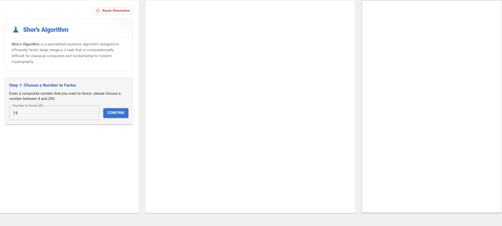
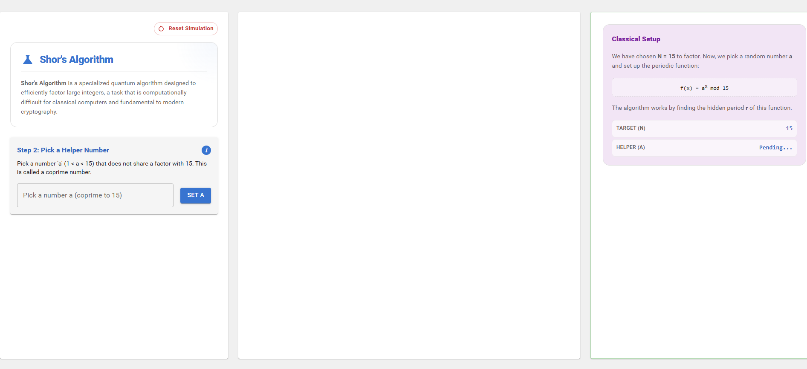
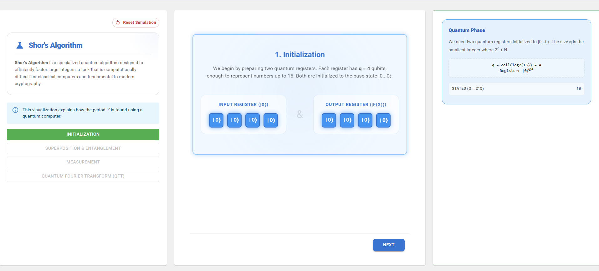
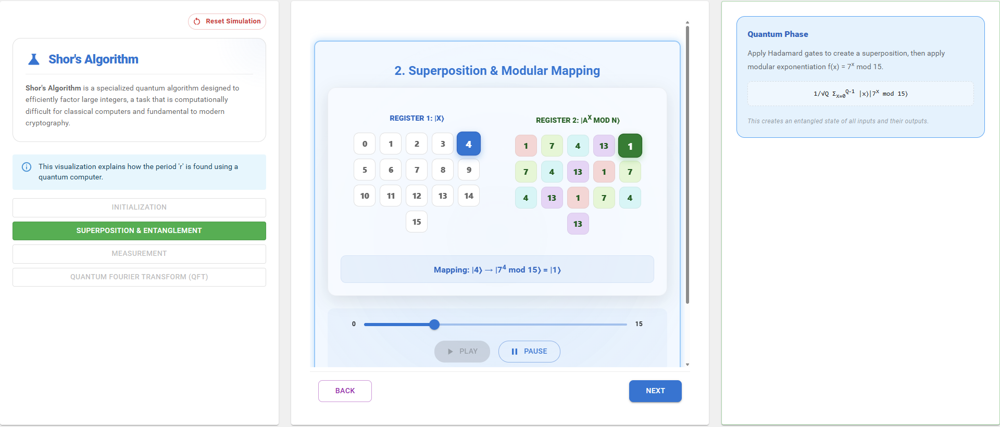
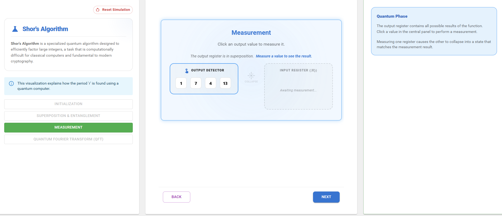
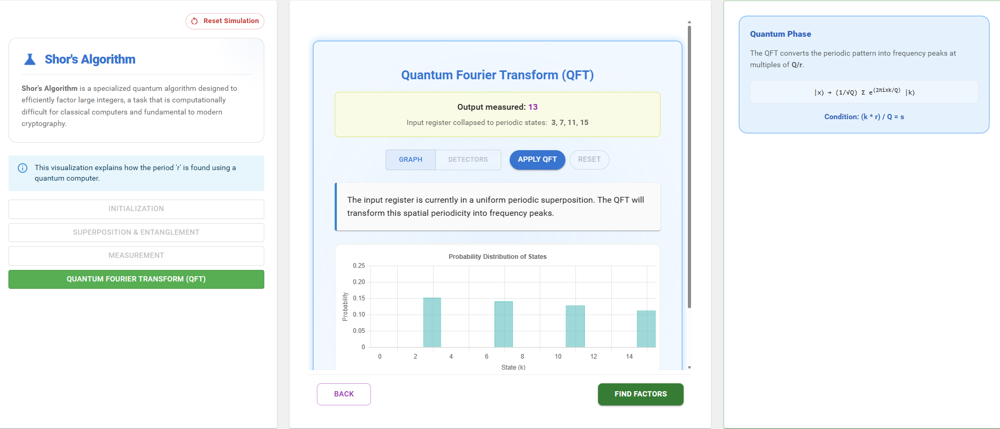
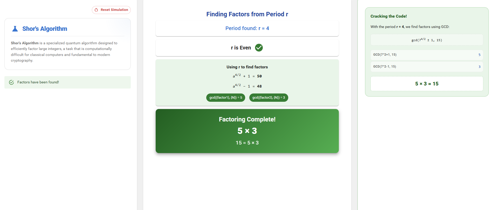

1. **Enter a Number to Factor:**  
   Enter a composite number that you want to factor and click the **Confirm** button.

   

2. **Choose a Coprime Number:**  
   Select a number **a** that is coprime with the chosen number \(N\), then click the **Set A** button to proceed.

   

3. **Observe Initialization:**  
   The simulation initializes two quantum registers. Observe the initialized registers and click the **Next** button to move to the next step.

   

4. **Observe Superposition and Modular Mapping:**  
   The system creates a superposition of input states and performs modular exponentiation mapping. Observe how the input register states map to the output register values.

   

5. **Perform Measurement:**  
   Click one of the output values to perform a measurement and observe how the quantum state collapses based on the selected result.

   

6. **Apply Quantum Fourier Transform (QFT):**  
   Click the **Apply QFT** button. The Quantum Fourier Transform converts the periodic structure of the state into frequency peaks that help identify the period \(r\).

   

7. **Determine the Factors:**  
   Using the discovered period \(r\), the simulation computes the factors of the chosen number \(N\). Observe the calculated factors displayed in the simulation.

   